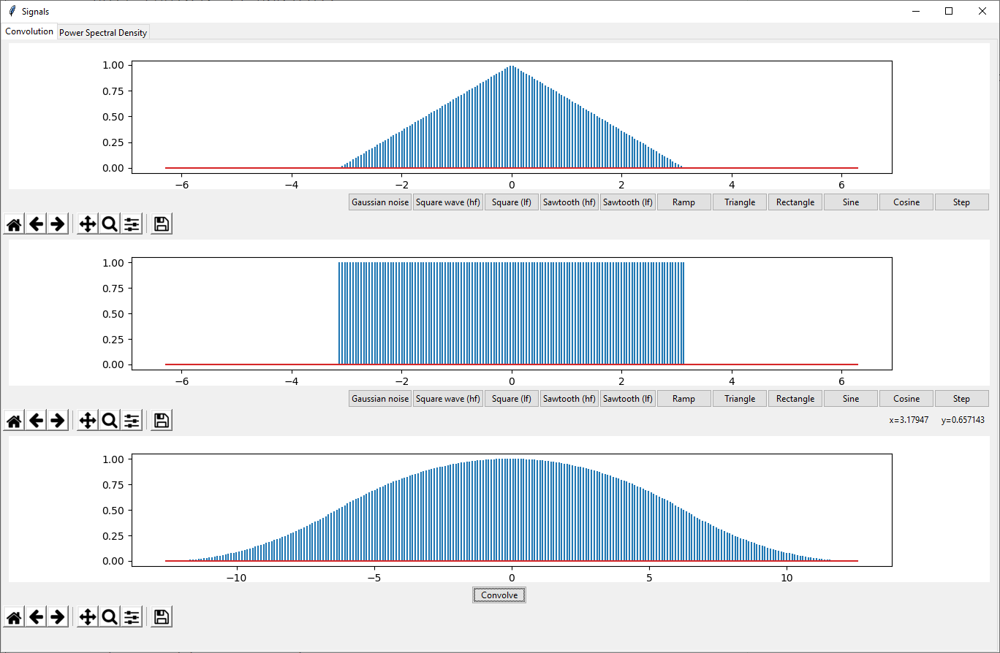

# signals
 convolution/psd visualizer

 Python 3.7.4

 Dependencies: Numpy, matplotlib, scipy

 Run
 ``python window.pyw``
 from command line or open with file explorer

 Below are some example screenshots. 
 
 Note: since the inputs are signals of finite length, the outputs can only be approximately accurate. Given that, the general behavior of the signals is most important with regards to visualization, and thus the outputs are normalized to [-1, 1].

 Convolution example
 ------
  
 
 
 Power Spectral Density example
 ------
  
 
